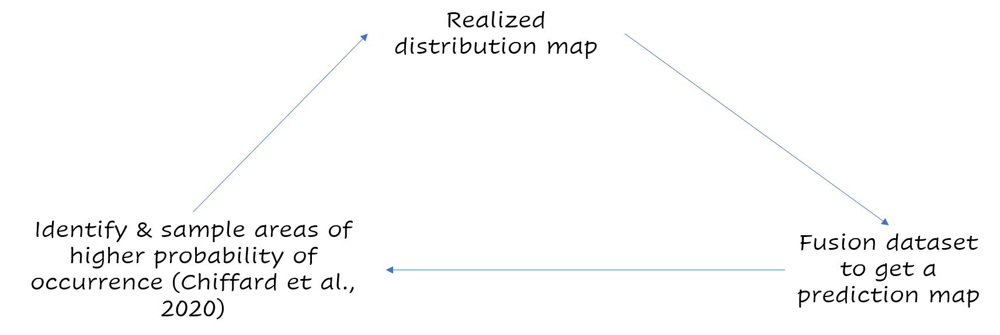

class: inverse, center, middle

# **1st phase: Using distribution data**
## First paper

# `r emo::ji("unicorn")`


---
# First paper 

* **Compile** different source of data to make distribution maps of ungulates species in Europe.

* The resulting distribution maps are used to **inform about human-wildlife coexistence**.

```{r, echo = FALSE, out.width="600px"}
knitr::include_graphics('imgs/paper1.png')
```

---

# First paper

* **We summarize** knowledge on wild ungulates distribution in Europe.

* About **90%** of Europe is home to at least one species of wild ungulates.

* **75%** of wild ungulate distribution is located outside protected areas

* We explore the interactions between ungulates and humans in Europe's anthropogenic landscape.

* More than **7 million ungulates** are harvested each year in Europe.

---
class: center, middle

```{r, echo = FALSE}
knitr::include_graphics('imgs/distribung.png')
```

---
class: center, middle

```{r, echo = FALSE}
knitr::include_graphics('imgs/summary1.png')
```

---

class: inverse, center, middle

# **1st phase: Using distribution data**
## Second paper

# `r emo::ji("flex")`

---
# 2nd paper

* In this paper, **we evaluate the relative effects of both the human footprint and protected areas** on large mammal distribution at a continental scale.

* We found that the broad scale distribution of most large mammals in Europe includes areas of high to very high human disturbance. 

* **Their distribution is primarily driven by environmental variables** rather than the human footprint or the presence of protected areas. 

```{r, echo = FALSE, out.width="600px"}
knitr::include_graphics('imgs/paper2.png')
```

---
class: center, middle

```{r, echo = FALSE}
knitr::include_graphics('imgs/effecthuman.png')
```
---
class: inverse, center, middle

# **1st phase: Using distribution data**
## 3rd paper

# `r emo::ji("flex")`

---
# 3rd paper

* **A huge amount of distributional data come from hunting bags.** For instance deer maps in Norway from hunting bag data.

* We acknowledge hunters’ contribution to biodiversity monitoring in the 3rd paper.

```{r, out.width= "600px", echo = FALSE}
knitr::include_graphics('imgs/paper3.png')
```

---
# 3rd paper

We found that hunters contribute to monitoring biodiversity in all its key characteristics:

* **Distribution** - through carcasses ...

* **Phenology** - through carcasses ...

* **Physiology** - through carcasses ...

* **Migration** - through carcasses too ...

And much more!

---
class: inverse, center, middle

# **2nd phase: Understanding distribution data**
## Characterizing CS data & account for its biases

# `r emo::ji("surfer")`

---
# 2nd phase

* While useful (as shown in phase 1), distribution maps heavily depends on the quality & the amount of data available. This is especially true at lower resolution!

* Because of this, certain areas may be non sampled even though the species of interest is present.

* We need to understand the drivers of citizen science observations. 

* Using the understanding to properly integrate the dataset & obtain more accurate prediction maps.

---
class: center, middle

```{r, echo = FALSE, out.width="400px"}
knitr::include_graphics('imgs/csmap.png')
```

Some areas should host roe deer but are not sampled by CS.

Some areas are non hunted but hosts citizen scientists observations.
---
# 2nd phase

How are data generated?


```{r, echo = FALSE}
knitr::include_graphics('imgs/obsprocess.png')
```

---
# 2nd phase

* Case study on the distribution of roe deer (Capreolus capreolus).

* We have telemetry data and we are able to infer the “true” use of the habitat or where the species is in reality

* Is it so different from citizen science?

---
class: center, middle

```{r, echo = FALSE}
knitr::include_graphics('imgs/cs_bias.png')
```
---
class: center, middle

```{r, echo = FALSE}
knitr::include_graphics('imgs/telem.png')
```
---
# 2nd phase

* Why such differences in the distribution of the observations?

* Which areas lack observations? – We hypothesize areas far from urban centers

* Can we tone down these biases by adding other dataset? – We test data fusion

---
class: inverse, center, middle

# And next ...

# `r emo::ji("surfer")`

---
# Next ...

* Using the part 1 results to fusion properly the dataset & obtain more accurate prediction maps and compare them to the observed distribution.

* These prediction maps can be used to identify areas worth sampling. 

* Citizen Scientists could be used to sample these areas.

* Their data could then be used to recompute the prediction maps

---
class: center, middle

```{r, echo = FALSE}

```

---
class: center, middle

PhD plan in a nutshell:

```{r, echo = FALSE}
knitr::include_graphics('imgs/nutshell.png')
```

---
class: inverse, middle, center

# Thank you for your attention


Slides made with `r emo::ji("heart")` and **xaringan**