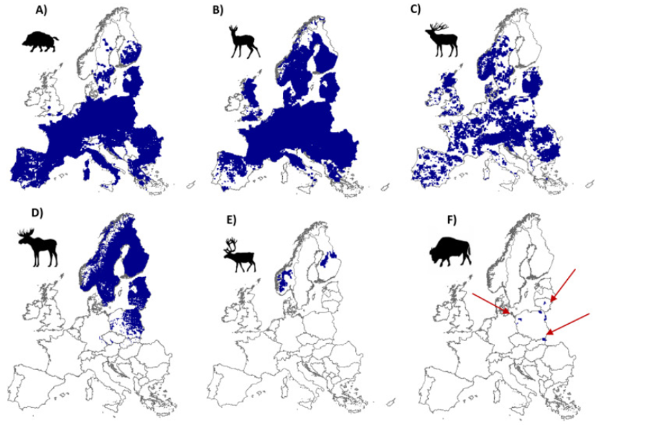

class: inverse, middle, center

## Keep in touch!

`r icon::fa("paper-plane")` [benjamin.cretois@ntnu.no](benjamin.cretois@ntnu.no)

`r icon::fa("twitter")` [Benjamin_M_CR](https://twitter.com/Benjamin_M_CR)

`r icon::fa("github")` [BenCretois](https://github.com/BenCretois)

`r icon::fa("link")` [benjamincretois.netlify.app](https://benjamincretois.netlify.app/)

---
class: inverse, middle, center

# **A bit of Background ...**

## What is Citizen science?
---
# What is Citizen Science?

* The contribution of citizens to the collection of data and in some cases to the protocol

* In my case, citizen science data represents species observations made by a citizen

--


---
class: inverse, center, middle

# **1st phase: Using distribution data**
## First paper
## `r emo::ji("newspaper")`

---
# First paper 

* **Compile** different source of data to make distribution maps of ungulates species in Europe.

* The resulting distribution maps are used to **inform about human-wildlife coexistence**.

```{r, echo = FALSE, out.width="600px"}
knitr::include_graphics('imgs/paper1.png')
```

---

# First paper

* **We summarize** knowledge on wild ungulates distribution in Europe.

* About **90%** of Europe is home to at least one species of wild ungulates.

* **75%** of wild ungulate distribution is located outside protected areas

* We explore the interactions between ungulates and humans in Europe's anthropogenic landscape.

* More than **7 million ungulates** are harvested each year in Europe.

---
class: center, middle

```{r, echo = FALSE}

```

---
class: center, middle

```{r, echo = FALSE}
knitr::include_graphics('imgs/summary1.png')
```

---

class: inverse, center, middle

# **1st phase: Using distribution data**
## Second paper
## `r emo::ji("newspaper")`

---
# 2nd paper

* In this paper, **we evaluate the relative effects of both the human footprint and protected areas** on large mammal distribution at a continental scale.

* We found that the broad scale distribution of most large mammals in Europe includes areas of high to very high human disturbance. 

* **Their distribution is primarily driven by environmental variables** rather than the human footprint or the presence of protected areas. 

```{r, echo = FALSE, out.width="600px"}
knitr::include_graphics('imgs/paper2.png')
```

---
class: center, middle

```{r, echo = FALSE}
knitr::include_graphics('imgs/effecthuman.png')
```
---
class: inverse, center, middle

# **1st phase: Using distribution data**
## 3rd paper
## `r emo::ji("newspaper")`

---
# 3rd paper

* **A huge amount of distributional data come from hunting bags.** For instance deer maps in Norway from hunting bag data.

* We acknowledge hunters’ contribution to biodiversity monitoring in the 3rd paper.

```{r, out.width= "600px", echo = FALSE}
knitr::include_graphics('imgs/paper3.png')
```

---
# 3rd paper

We found that hunters contribute to monitoring biodiversity in all its key characteristics:

* **Distribution** - through carcasses ...

* **Phenology** - through carcasses ...

* **Physiology** - through carcasses ...

* **Migration** - through carcasses too ...

And much more!

---
class: inverse, center, middle

# **2nd phase: Understanding distribution data**
## Characterizing CS data & account for its biases

# `r emo::ji("stats")`

---
# 2nd phase

* While useful (as shown in phase 1), **distribution maps heavily depends on the quality & the amount of data available**. This is especially true at lower resolution!

* Because of this, certain areas may be non sampled even though the species of interest is present.

* We need to understand the drivers of citizen science observations & which biases they exhibit. 

* We can then use this understanding to properly integrate the dataset & obtain more accurate prediction maps.

---
class: center, middle

```{r, echo = FALSE, out.width="400px",message=FALSE, warning=FALSE}
library(sf)
library(tidyverse)
library(tmap)

data <- read_sf("data/cs_telem_oslo_roedeer.shp")
data_cs <- data %>% filter(type == 'cs')

tmap_mode('plot')
tm_shape(data_cs) + tm_dots()
```

Some areas **should** host roe deer but are not sampled by CS.

Some areas are non hunted but hosts citizen scientists observations.
---
# 2nd phase

How are data generated? `r emo::ji("spy")`

--

```{r, echo = FALSE}
knitr::include_graphics('imgs/obsprocess.png')
```

---
# 2nd phase

* Case study on the distribution of roe deer (*Capreolus capreolus*) and moose (*Alces alces*).

* We have telemetry data and we are able to infer the **“true”** use of the habitat or where the species is in reality.

--

* Are telemetry observations so different from citizen science?

---
class: center, middle

```{r, echo = FALSE}
knitr::include_graphics('imgs/cs_bias.png')
```
---
class: center, middle

```{r, echo = FALSE}
knitr::include_graphics('imgs/telem.png')
```
---
class: inverse

# Challenges

* The model I want to implement (i.e. **Point process model**) is relatively new in ecology even though quite developed in other areas.

* The data I have are subjects to **Spatial biases** and **Temporal biases**. We need to include both of them in our statistical model

* **Very difficult** to account for ...

* I had to team up with some statisticians at the Department of Mathematics

* If you want more detail about point process models visit my website: https://benjamincretois.netlify.app/post/

---
class: inverse, center, middle

# **2nd phase**

## A case study on data fusion / data integration

## `r emo::ji("stats")`

---
# 2nd phase

```{r, echo = FALSE, out.width="400px"}
knitr::include_graphics('imgs/isaac.png')
```

*Taken from: Isaac et al. 2020. Data Integration for Large-Scale Models of Species Distributions, Trends in Ecology and Evolution. 

---
# A case study on data fusion / data integration

* With a data fusion strategy, I would like to evaluate the possibility of improving the performance of Citizen Science data in making species' distribution maps

* I would use a wide range of dataset including TOV-E data, Hunting dataset, camera traps ...

---
class: inverse, middle, center

# Prosection for after the PhD ...

# `r emo::ji("doubt")`

---
class: inverse, middle, center

# Thank you for your attention

### Slides available here: https://bencretois.github.io/my_work_presentation/#1


Slides made with `r emo::ji("heart")` and **xaringan**