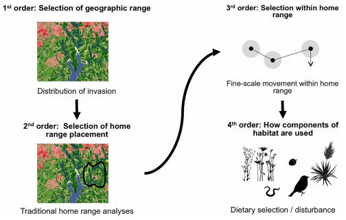

class: inverse, center, middle

# A quick overview of my background

# `r emo::ji('cap')`
---

# 1 - Background

* A year in **Classes preparatoires** in **Mathematics**

* Two years in the **Navy infantry** as a sergeant 

* Bachelor in **Ecology and Evolution** in Caen, France

* Master in **Environment and Law** in Rennes, France - Master thesis done at NINA under the supervision of *JDC Linnell*

* PhD in **Spatial Data Analysis** at NTNU and NINA under the supervision of *Jan Ketil Rød, Erlend B. Nilsen and JDC Linnell*

* Data Scientist at NINA in **Miljødata** since the 1st of April 2021

---
class: inverse, center, middle

# 2 - PhD work

### An introduction to the topic

# `r emo::ji('library')`

---
### An introduction to the topic

* What is **citizen science**?

* How are citizen science data generated?

* We have to differentiate the *observation* and *reporting process*


.center[
```{r, echo = FALSE, out.width="400px"}

```
]

---
### An introduction to the topic

* During the PhD we looked more precisely at the **data generation process in hunters** and 
the extent of data they are able to collect

* This lead to a first paper:

.center[
```{r, echo = FALSE, out.width="500px"}

```
]

.footnote[
Link to [Cretois et al. 2020](https://www.sciencedirect.com/science/article/pii/S2351989420303632)
]


---
### An introduction to the topic

For citizen science data, the observation process is driven by multiple factors which can be grouped into **four broad categories**:

.center[
```{r, echo = FALSE, out.width="800px"}

```
]

---
### An introduction to the topic

.center[
```{r, echo = FALSE, out.width="500px"}

```
]

---
### An introduction to the topic

For citizen science data, the observation process is driven by multiple factors which can be grouped into **four broad categories**:

.center[
```{r, echo = FALSE, out.width="800px"}

```
]

* But do the biases really matter when making inference about species' ecology?

* **It depends at which scale we are making the inference!**

---
### An introduction to the topic

The notion of scale in ecology:

.center[
```{r, echo = FALSE, out.width="600px"}

```
]

.footnote[
Source: [Froehly et al. (2020)](https://journals.plos.org/plosone/article?id=10.1371/journal.pone.0228705)
]

---
class: inverse, center, middle

# 2 - PhD work

### Results

# `r emo::ji('stats')`

---
### Results


* **The lower the resolution, the more information is needed** to infer species' distribution

* At very small grain sizes, it becomes difficult to even confirm the presence/absence
of a species

* This is **especially the case for highly mobile animals** that range over wide areas and
multiple habitat types


.center[
```{r, echo = FALSE, out.width="400px"}

```
]

---
### Results

* At **coarse grain size** (i.e. at county levels), the distribution of the species is very plausible although not detailed.

* Therefore, biases such as distance to trails or distance to roads do not influence this knowledge as there is road network in all counties in Norway

* With **finer grain sizes comes more uncertainty** regarding roe deer distribution and small grain only partially captures the distribution of roe deer in Norway.

--

* How to deal with very biased data at **large** and **small** scale?

.center[
```{r, echo = FALSE, out.width="600px"}

```
]

---
### Results

Dealing with biases at large scale:

* **Combining dataset**: different dataset carry different biases and the information brought by each dataset will differ as the grain size decreases (CS data vs hunter data vs car-ungulate collisions)

.center[
```{r, echo = FALSE, out.width="600px"}

```
]

.footnote[
Link to [Linnell & Cretois et al. 2020](https://www.sciencedirect.com/science/article/pii/S0006320719318312)
]

---
### Results

Dealing with biases at small scale:

* **Quantifying and integrating the biases** in CS observations into a statistical model

.center[
```{r, echo = FALSE, out.width="800px"}

```
]

.footnote[
Link to [Sicacha Parada al. 2020](https://www.sciencedirect.com/science/article/pii/S2211675320300403)
]

---
class: inverse, center, middle

# 3 - My role at NINA

### ... and what I can help you with!

# `r emo::ji('stats')`
---
# What is a data scientist?

.center[
```{r, echo = FALSE, out.width="500px"}
knitr::include_graphics('imgs/datascience.PNG')
```
]

---
### Machine learning vs statistics

.center[
```{r, echo = FALSE, out.width="400px"}

```
]

.center[
**Machine learning is not a fancy name for statistics!**
]

---
# What I can help you with!

* Give support to research projects in diverse ways using **machine learning** and **statistics**

.center[
```{r, echo = FALSE, out.width="400px"}
knitr::include_graphics('imgs/ds_workflow.PNG')
```
]

* I am **very open to collaborate with very different topics**!

* I can also apply to / be part of research projects 

* I would actually like to continue doing **some research** along with other Miljødata tasks


---
### Spatial data analysis & statistics:

* My PhD largely focused on **spatial data analysis**

* *Spatial statistical models*: point processes, CAR models

* *GIS software*: ArcGIS, QGIS and R (yes GIS in R!)

.center[
```{r, echo = FALSE, out.width="500px"}
knitr::include_graphics('imgs/distribung.png')
```
]

.footnote[
Figure from [Linnell & Cretois et al. 2020](https://www.sciencedirect.com/science/article/pii/S0006320719318312)
]

---
### Machine learning for image & sound classification:

* I recently found a strong interest in **deep learning**!

* For instance, applying **Neural networks** to image / sound classification


.center[
```{r, echo = FALSE, out.width="800px"}
knitr::include_graphics('imgs/panda2.PNG')
```
]

---
### Image / sound detection and classification:

.center[
<html>
<audio controls>
  <source src="other_file/mix_exple.wav" type="audio/wav">
</audio></html>
]

.center[
```{r, echo = FALSE, out.width="600px"}

```
]

---
class: center, middle

background-image: url(https://miro.medium.com/max/3840/1*oB3S5yHHhvougJkPXuc8og.gif)
background-size: contain 

.footnote[
Source: [Andrew Ng](https://en.wikipedia.org/wiki/Andrew_Ng)]

---
class: center, inverse

# 4 - To summarize ...

.RUred[I have worked extensively with .orange[crouwdsourced / Citizen science] data during my PhD]

--

.RUred[I have experience with .orange[spatial data analysis] and more generally statistics, machine learning and GIS]

--

.RUred[I have a strong interest in .orange[deep learning] for image / sound classification and wish to do more of it!]

--

.RUred[I am quite knowledgeable in .orange[R] and try to learn more .orange[Python]]


---

